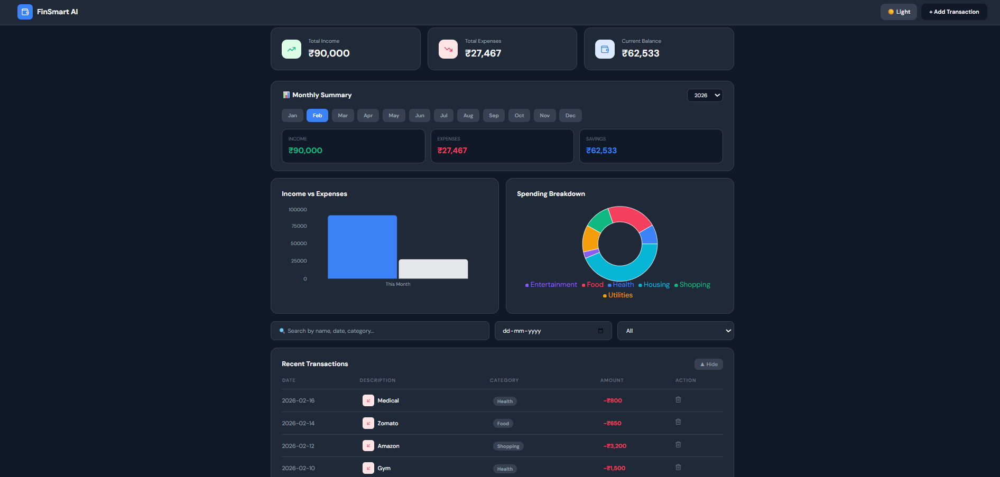
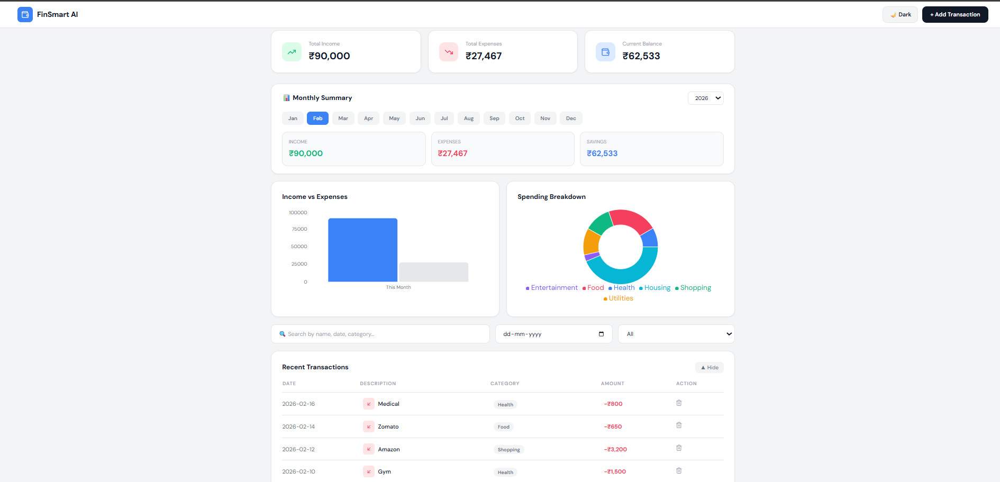

# FinSmart AI 💰
### AI-Powered Personal Finance Tracker

A full-stack personal finance dashboard with AI-driven insights, real-time transaction tracking, budget planning, and savings goal management.

---

## 📸 Screenshots




---

## 🚀 Features

- **Dashboard** — Income, expense, and balance overview with interactive charts
- **AI Financial Advisor** — Personalized spending analysis and budgeting recommendations
- **Transaction Management** — Add, delete, and search transactions with advanced filters
- **Budget Planner** — Set monthly category limits with real-time progress tracking
- **Savings Goal Tracker** — Monitor multiple goals with deadline and contribution tracking
- **Monthly Summary** — Month-by-month breakdown with year selector
- **Dark / Light Mode** — Full theme toggle support
- **Responsive UI** — Clean, modern design with Tailwind CSS

---

## 🛡️ Security Features

- **Environment Secrecy** — Sensitive database credentials stored in `.env` and excluded from version control via `.gitignore`
- **SQL Injection Prevention** — All database interactions use parameterized queries (`$1, $2, $3...`), eliminating the risk of SQL injection attacks
- **Dependency Isolation** — `node_modules` excluded from version control; dependencies declared in `package.json` for reproducible installs

---

## 🧠 Key Technical Challenges

**State Synchronization**
Managing real-time UI updates across multiple independent components (Budget Planner, Transaction Table, Dashboard stats) required careful React state architecture. Solved by lifting shared state to ensure all views stay consistent.

**Data Integrity**
Implemented upsert logic (`ON CONFLICT`) in PostgreSQL to prevent duplicate budget entries per category, ensuring data consistency across the application.

**Git Submodule Conflict**
Nested `.git` folders caused `backend` and `finance-tracker` to be treated as submodules. Resolved by removing inner `.git` directories and reconfiguring the root repository.

---

## 🛠️ Tech Stack

| Layer | Technology |
|-------|-----------|
| Frontend | React (Vite), Tailwind CSS, Recharts |
| Backend | Node.js, Express.js |
| Database | PostgreSQL |

---

## 📁 Project Structure

```
finsmart-ai/
├── backend/
│   ├── server.js         # Express API server
│   ├── db.js             # PostgreSQL connection
│   ├── .env              # Environment variables (not tracked)
│   └── package.json
├── finance-tracker/      # React frontend
│   ├── src/
│   │   ├── components/
│   │   │   ├── Dashboard.jsx
│   │   │   ├── AIInsights.jsx
│   │   │   ├── BudgetPlanner.jsx
│   │   │   └── SavingsGoals.jsx
│   │   └── main.jsx
│   └── package.json
├── screenshots/
│   ├── dashboard-dark.png
│   └── dashboard-light.png
├── .gitignore
└── README.md
```

---

## ⚙️ Getting Started

### Prerequisites
- Node.js v18+
- PostgreSQL

### 1. Clone the repository
```bash
git clone https://github.com/Palak-0406/finsmart-ai.git
cd finsmart-ai
```

### 2. Set up the database
Create a PostgreSQL database named `financetracker` and run:

```sql
CREATE TABLE transactions (
  id SERIAL PRIMARY KEY,
  name VARCHAR(255),
  amount DECIMAL,
  category VARCHAR(100),
  type VARCHAR(50),
  date DATE,
  created_at TIMESTAMP DEFAULT NOW()
);

CREATE TABLE budgets (
  id SERIAL PRIMARY KEY,
  category VARCHAR(100) UNIQUE,
  budget_amount DECIMAL
);

CREATE TABLE goals (
  id SERIAL PRIMARY KEY,
  name VARCHAR(255),
  target_amount DECIMAL,
  current_amount DECIMAL DEFAULT 0,
  deadline DATE,
  created_at TIMESTAMP DEFAULT NOW()
);
```

### 3. Configure environment
Create `backend/.env`:
```
DB_USER=postgres
DB_PASSWORD=your_password
DB_HOST=localhost
DB_PORT=5432
DB_NAME=financetracker
```

### 4. Run the backend
```bash
cd backend
npm install
node server.js
# Runs on http://localhost:5000
```

### 5. Run the frontend
```bash
cd finance-tracker
npm install
npm run dev
# Runs on http://localhost:5173
```

---

## 📡 API Endpoints

| Method | Endpoint | Description |
|--------|----------|-------------|
| GET | `/api/transactions` | Fetch all transactions |
| GET | `/api/transactions?date=YYYY-MM-DD` | Filter by date |
| POST | `/api/transactions` | Add a transaction |
| DELETE | `/api/transactions/:id` | Delete a transaction |
| GET | `/api/budgets` | Fetch all budgets |
| POST | `/api/budgets` | Add or update a budget |
| DELETE | `/api/budgets/:id` | Delete a budget |
| GET | `/api/goals` | Fetch all savings goals |
| POST | `/api/goals` | Add a savings goal |
| PATCH | `/api/goals/:id` | Update goal progress |
| DELETE | `/api/goals/:id` | Delete a goal |
